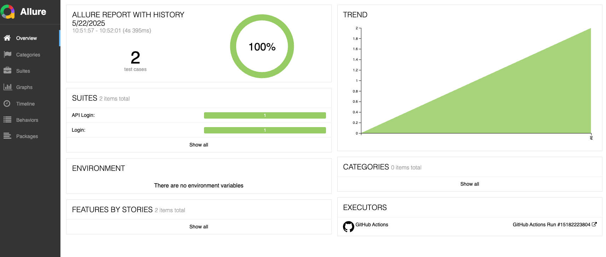
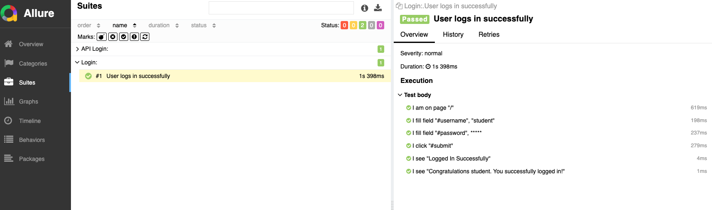

# CodeceptJS Monorepo (TypeScript)

A TypeScript-based monorepo for end-to-end (E2E) and API test automation using [CodeceptJS](https://codecept.io/) with Playwright and REST helpers. This setup provides:

- **API tests** under `tests/api`
- **Web E2E tests** under `tests/web`
- Shared utilities & step definitions under `common/`
- GitHub Actions workflow for CI

---

## 📁 Repository Structure

```
├── common/
│   ├── helpers/
│   │   └── dataGenerator.ts      # Shared data creation utilities
│   └── steps/
│       └── steps\_file.ts         # Shared step definitions (actor)
│
├── tests/
│   ├── api/
│   │   ├── codecept.conf.ts      # API-specific CodeceptJS config
│   │   ├── support/api/
│   │   │   └── userApi.ts        # API helper for authentication
│   │   └── tests/
│   │       └── login\_test.ts     # Example API login scenario
│   │
│   └── web/
│       ├── codecept.conf.ts      # Web-specific CodeceptJS config
│       ├── support/pageObjects/
│       │   └── loginPage.ts      # Page Object for login page
│       └── tests/
│           └── login\_test.ts     # Example UI login scenario
│
├── .github/
│   └── workflows/
│       └── test.yml              # CI workflow for both API & web suites
│
├── output/                       # Test report outputs
│
├── tsconfig.json                 # TypeScript compiler options
├── package.json                  # Dependencies & scripts
└── README.md                     # This file

````

---

## 🚀 Getting Started

### Prerequisites

- Node.js ≥ 16
- npm (or yarn)
- (Optional) [Allure CLI](https://github.com/allure-framework/allure2) for rich HTML reports

### Install Dependencies

```bash
npm install
````

---

## ⚙️ Configuration

All environment-specific variables (endpoints, credentials, headless flags, etc.) can be managed via a standard `.env` file and loaded in your configs using `dotenv`.

---

## 🧪 Running Tests

* **API suite**

  ```bash
  npm run test:api
  ```
* **Web E2E suite**

  ```bash
  npm run test:web
  ```

Each command compiles your TypeScript and then runs CodeceptJS against the corresponding `dist/tests/.../codecept.conf.js`.

---

## 📈 CI Integration

A GitHub Actions workflow is provided at `.github/workflows/test.yml`. It spins up on every push or PR to `main`, runs both suites in parallel matrix (`api`, `web`), and uploads the `output/` folder as artifacts.

---

## 🖼️ Sample Report
👉 View Latest Live Report:
📍 https://kobenguyent.github.io/codeceptjs_monorepo_ts/

Includes:

Step-by-step breakdown

Request/response logging (for API)

Screenshots for failed UI tests





---

## 🔧 Customization

* **Add new suites**:
  Create a new subfolder under `tests/` (e.g. `mobile/`) with its own `codecept.conf.ts`, tests and support files.
* **Shared utilities**:
  Place reusable helpers or step definitions under `common/helpers` or `common/steps`.
* **Reporting**:
  Enable [Allure](https://docs.qameta.io/allure/) or [Mochawesome](https://github.com/adamgruber/mochawesome) in your CodeceptJS config for advanced reporting.

---

## 🙌 Contributing

1. Fork repository
2. Create feature branch (`git checkout -b feature/my-new-test`)
3. Commit changes (`git commit -m "Add new test"`)
4. Push branch (`git push origin feature/my-new-test`)
5. Open a Pull Request

---

## 📜 License

This project is licensed under the [MIT License](LICENSE).

---

Happy testing! 🚀

